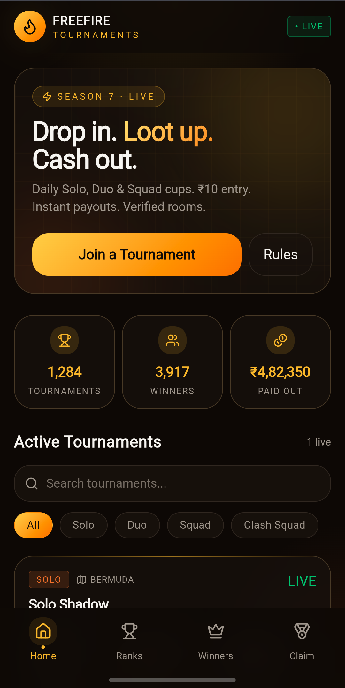
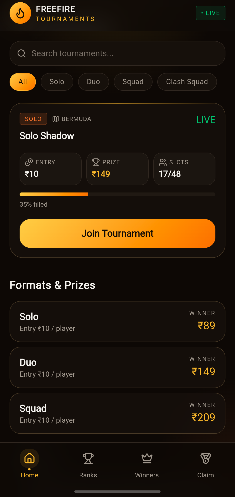

# Free Fire Tournament Management Platform

Production-ready full-stack Free Fire tournament management platform built with React, TypeScript, TanStack Start, and Supabase. The platform enables players to discover tournaments, register for matches, track rankings, view winners, and participate in competitive esports events through a modern mobile-first experience.

## Live Demo

🔗 https://freefire-tournments-ss.lovable.app

---

## Overview

Free Fire Tournament Management Platform is a full-stack esports web application designed to streamline tournament operations and player participation. The platform provides an intuitive interface for browsing active tournaments, viewing prize pools, registering for matches, and tracking tournament outcomes, while enabling administrators to manage tournament data and operations efficiently.

---

## Key Features

* Tournament Discovery & Listings
* Player Registration Workflow
* Solo, Duo, Squad & Clash Squad Formats
* Prize Pool & Entry Fee Management
* Match Scheduling & Coordination
* Live Tournament Status Tracking
* Rankings & Winners Sections
* Administrative Management Controls
* Real-Time Data Management with Supabase
* Mobile-First Responsive Design
* Production Deployment
* Modern Gaming-Focused User Experience

---

## Tech Stack

### Frontend

* React 19
* TypeScript
* TanStack Start
* TanStack Router
* TanStack Query
* Tailwind CSS
* Radix UI
* Framer Motion

### Backend & Database

* Supabase
* Supabase Database
* Supabase Migrations

### Forms & Validation

* React Hook Form
* Zod

### Development Tools

* Vite
* ESLint
* Prettier

---

## Screenshots

### Home Page



### Tournament Listing & Registration



---

## Project Metrics

* 88+ Unique Visitors
* 680+ Page Views
* 4+ Minutes Average Session Duration
* Production Deployment with Real User Traffic

---

## Architecture Highlights

* Built using a modern React + TypeScript architecture.
* Utilizes Supabase for backend services and persistent data storage.
* Client-side routing powered by TanStack Router.
* Data fetching and state synchronization handled through TanStack Query.
* Component-driven UI architecture using Radix UI.
* Responsive design implemented with Tailwind CSS.
* Optimized for mobile users and tournament participants.

---

## Project Structure

```text
src/
├── components/
├── hooks/
├── routes/
├── lib/
├── integrations/
├── assets/

supabase/
├── migrations/

README.md
```

---

## Future Enhancements

* User Authentication System
* Match History Tracking
* Tournament Notifications
* Payment Gateway Integration
* Advanced Tournament Analytics
* Enhanced Administrative Controls

---

## Author

**Sameer Gandhi**

---

## License

This project is intended for portfolio, educational, and esports tournament management purposes.
